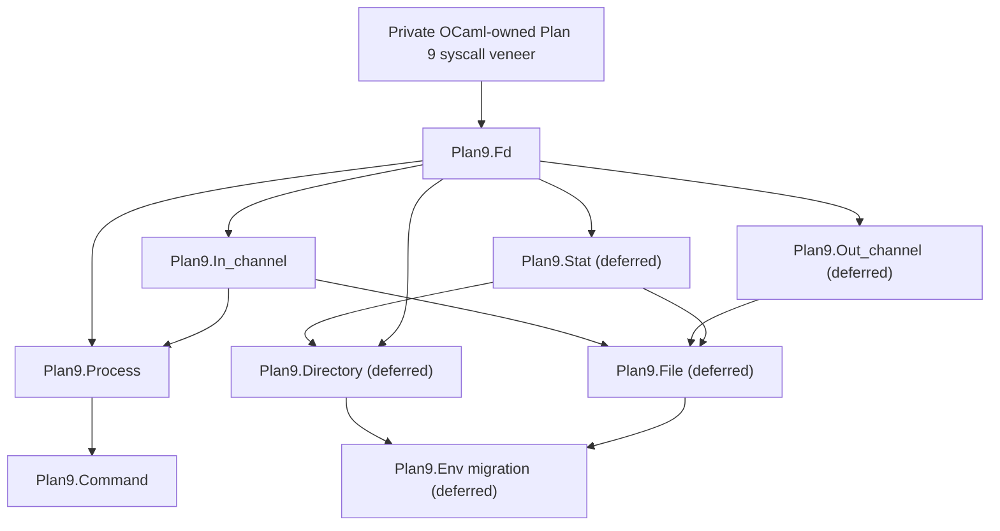

# OCaml Plan 9 native I/O foundation

Status: accepted design; Phase 0 implemented, reviewed, and natively
qualified at `aa627e94e9db4a680a30c8e3671a00e709a97320`; Phase 1 handoffs are
drafted for review

Source handoff:
`C:\Users\dharm\src\caml9\docs\design\handoffs\ocaml-plan9-process-run-capture.md`

The Caml9 source remains unchanged. This document adopts the handoff's process
capture goal and records the subsequent decision to establish a reusable,
Plan 9-native I/O foundation before implementing capture.

## Repository identities

- Published Plan 9 baseline: `plan9-4.14.3-000` at
  `a98e773a80311653d7a78763bd017328b5c26b52`.
- `origin/plan9-4.14.3-000` still resolved to that published commit when this
  design branch was created.
- Local working base: `plan9-4.14.3-000` at
  `835bc29b0c276a83211a517b950a55f0fb9c2bfe`. Its only change from the
  published baseline is the reviewed local Plan 9 workflow skills.
- Design and implementation branch: `codex/plan9-native-io-foundation`,
  created at `835bc29b0c276a83211a517b950a55f0fb9c2bfe`.
- Reviewed Phase 0 documentation checkpoint:
  `4209e21088f8ba0f5c5985fcec79e41d4cffcb77`.
- Accepted Phase 0.1 raw ABI and build checkpoint:
  `0d3ac056a37e597e9673607de591cb8a0b5247bb`. It is implemented, reviewed,
  natively qualified, committed, and pushed on the feature branch.
- Reviewed Phase 0.2 documentation checkpoint:
  `3c2fe24efb50aff2b7b00795868228712e01848a`.
- Accepted Phase 0.2 capability lifecycle checkpoint:
  `f2bc2dd152a3cb5e5541edc6aee4927ff4c6d83b`. It is implemented, reviewed,
  natively qualified, committed, and pushed on the feature branch.
- Reviewed Phase 0.3 documentation checkpoint:
  `dcbb9f2d2b31a31a7ccf6d946957fa5e132df3d1`.
- Accepted Phase 0 and Phase 0.3 byte-I/O checkpoint:
  `aa627e94e9db4a680a30c8e3671a00e709a97320`. It is implemented, reviewed,
  natively qualified, committed, and pushed on the feature branch.
- Preserved prototype branch:
  `codex/archive/plan9-process-capture-prototype` at
  `1eb780b1b8467d1b80b35102e40371b87dde5604`. It is intentionally
  unvalidated and retains the rejected ordinary-`in_channel`/APE descriptor
  integration only as design history.

The feature branch must not be merged and no replacement OCaml release may be
published until its implemented layers have been reviewed and independently
qualified on native Plan 9. Commits and pushes require explicit user approval.

Phase 0 is accepted. The private boundary contains the five raw amd64 syscall
entries and raw harness, opaque capability lifecycle, guarded pipe
publication, deterministic close, native-failure construction, negative-path
probe, staged byte read/write integration, and complete focused ML test. It
still adds no public API, installed interface, or `plan9.cma` C payload.

## How to read this document

Each requirement is one of the following:

- **Decision**: agreed architecture that implementation must follow.
- **Phase 0 experiment**: a narrow build or ABI fact that must be proven before
  the public foundation is implemented.
- **Deferred decision**: intentionally settled when its owning layer is
  designed and reviewed.
- **Non-goal**: excluded from this work.
- **Acceptance criterion**: evidence required before a layer is accepted.

The first implementation milestone is only the private syscall veneer and its
proof. The broader module map is included so that this foundation does not
accidentally force later layers into an unsuitable dependency structure.

## Motivation and end-to-end target

The motivating application needs a direct command call whose successful use
is as small as:

```ocaml
let lines =
  Plan9.Command.run_capture_lines_exn
    ~program:"/bin/ndb/query"
    ~args:[| "-a"; "sys"; sysname; "ether" |]
    ()
```

The command must use a literal argument vector, capture stdout without a
temporary file, and return the output as lines. It must not use a shell, PATH
search, quoting, expansion, APE process dispatch, or NDB-specific logic.

The lower-level process operation must first capture the exact stdout bytes.
Line splitting belongs to `Plan9.Command` (using the native input semantics),
not to the process primitive. This preserves embedded NUL bytes, empty output,
newlines, and an unterminated final line at the reusable process layer.

## APE-independence boundary

**Decision.** The OCaml executable remains the single standard, APE-linked
`ocamlrun`. Portable `Stdlib`, `Sys`, and `Unix` behavior remains unchanged.
There will be no second runtime and no incompatible Plan 9-only OCaml runtime.

For the new native path, "APE-independent" means:

- no APE POSIX I/O, descriptor, process, environment, or wait facade;
- no APE `_fdinfo` registration or state;
- no APE-private syscall entry symbols such as `_PIPE`, `_PREAD`, `_READ`,
  `_WRITE`, `_CLOSE`, `_RFORK`, `_EXEC`, `_AWAIT`, or `_WAIT`;
- no APE wait parser, allocation, error translation, or process dispatch; and
- no conversion of a native descriptor into an ordinary OCaml `in_channel` or
  `out_channel`.

The raw syscall tier must call no C library function at all. The runtime
integration tier may use OCaml runtime allocation, rooting, and byte-copy
facilities; those are not the operating-system I/O path. The whole executable
may still contain and use APE for unrelated portable APIs.

This boundary is stronger than the current implementation:

| Existing module | Current native property | Remaining APE dependency |
| --- | --- | --- |
| `Plan9.Env` | Uses the live `/env` namespace instead of APE's cached environment | `Sys.readdir`, ordinary channels, and `Sys.remove` use the existing APE I/O path |
| `Plan9.Raw` | Avoids shell and APE process dispatch | Calls APE-private direct-entry symbols |
| `Plan9.Process` | Owns process lifecycle in OCaml and avoids POSIX spawning | Calls APE-private direct entries and the allocating `_WAIT` helper |

Those modules are migrated only when their dependency layer is ready. No
existing API is silently claimed to be fully APE-independent before then.

## Layered architecture

**Decision.** Public modules are small, have one-way dependencies, and are
implemented and reviewed from the bottom up.



The installed umbrella module `Plan9` only re-exports public modules and shared
types. Internal modules must never depend on the umbrella, preventing cycles
and making their actual dependencies visible in the build.

The intended ML source split is:

- `Plan9_types`: private shared error and identity types;
- `Plan9_primitive`: private bindings to validated runtime primitives;
- `Plan9_fd`: native descriptor ownership and byte I/O;
- `Plan9_in_channel`: buffered native input;
- `Plan9_process`: managed process lifecycle and capture; and
- `Plan9_command`: convenience command operations.

Only `plan9.cmi` is installed. Internal compilation interfaces remain
uninstalled, as `plan9_process.cmi` does today. `plan9.cma` remains ML-only;
the standard Plan 9 `ocamlrun` supplies the built-in primitives.

## Qualified source facts

The design fact check used the read-only 9front release checkout:

- location: `/home/dharmatech/src/9front-11554` in WSL;
- Git commit: `2191d72205863d2c53ea6ac36991cb4c13204c7c`;
- working tree: clean during the inspection; and
- initial architecture: amd64.

Relevant implementation sources are:

- `sys/src/libc/9syscall/mkfile:64-71`, for the amd64 stub recipe;
- `sys/src/libc/9syscall/sys.h:2-52`, for syscall numbers;
- `sys/src/cmd/pcc.c:128-146`, where the Plan 9 `c89` driver recognizes C
  source and object/archive inputs but not assembly source;
- `sys/src/libc/9sys/read.c` and `write.c`, which implement native logical
  reads and writes with `pread`/`pwrite` at offset `-1`;
- `sys/src/9/port/sysfile.c:113-136` and `209-240`, where `newfd2` reserves
  both descriptor slots before publishing either one and `syspipe` initializes
  the caller's results to `-1` and closes both channels on failure;
- `sys/src/9/pc64/l.s:918-959` and `trap.c:413-434`, for the amd64 kernel
  entry convention;
- `sys/src/ape/lib/ap/syscall/genall:1-16`, for APE's separate private
  entries; and
- `sys/src/ape/lib/ap/plan9/9wait.c:65-92`, `9read.c:7-10`,
  `read.c:9-45`, and `close.c:7-34`, for the APE helpers and descriptor
  bookkeeping being avoided.

Matching interface documentation came from `sys/man/2/errstr`, `pipe`, `read`,
`wait`, `fork`, `exec`, `dup`, and `open` in the same checkout. The tree's
`lib/legal/NOTICE` places the relevant Plan 9 and 9front work under the MIT
license.

**Phase 0 experiment.** The selected source is the ABI reference for the
draft, not proof of the exact files used to build a future guest kernel and
libraries. Before acceptance, the authorized development guest must report
its release and architecture, and the exercised behavior must agree with this
reference. A mismatch stops the gate; it is not silently treated as release
11554.

## Private syscall veneer

### Two internal tiers

**Decision.** The veneer is split into two tiers with different safety rules.

1. The raw syscall entry tier accepts only native C values and caller-owned
   buffers. It allocates nothing, constructs no OCaml value, consults no APE
   state, and calls no APE or C library function. It is safe for the constrained
   post-`rfork`, pre-`exec` child path.
2. The runtime integration tier validates OCaml values, roots them, stages
   bytes outside the OCaml heap when a blocking section requires it, invokes
   the raw tier, captures native errors immediately, and never allocates in a
   blocking section. Any fallible OCaml allocation needed to publish ownership
   of newly created native resources occurs before their acquisition, or the
   resources are closed before an allocating path can be taken.

The raw functions use repository-prefixed symbols such as
`caml_plan9_sys_pipe` and `caml_plan9_sys_pread`. They must not define or call
the native libc names or APE's underscore-prefixed names.

**Decision.** A private built-in primitive name is not an access-control
boundary: user code can declare its own `external` binding. No ML-facing
primitive may therefore accept or return a raw descriptor integer. Pipe
creation publishes opaque, validated descriptor capabilities, and descriptor
operations accept only capabilities created by this runtime path. The focused
Phase 0.2 handoff fixes the implementation decision as an exact-size private
custom block with runtime-owned operations identity and explicit unpublished,
open, and closed states. Its qualified amd64 payload is exactly two C `int`
members: the only consistent state/descriptor pairs are `unpublished`/`-1`,
`open`/nonnegative, and `closed`/`-1`. Its private custom-operations identity
uses the exact repository-unique identifier
`_ocaml_plan9_syscall_capability_v1`. It must reject forged values, every other
state/descriptor combination, states not accepted by the requested operation,
and descriptors not owned by this path before native work.

Validation is ordered defensively. Before reading any representation-specific
payload, the runtime tier checks the immediate/block distinction, the expected
tag, sufficient or exact block size as appropriate, and the runtime-owned
capability identity. Only after those outer checks succeed may it read the
capability state or descriptor. A forged look-alike must never cause an
out-of-bounds access or dereference of attacker-controlled representation
metadata.

This defensive guarantee covers correct-arity primitive calls receiving
arbitrary well-formed OCaml values, including values passed under a false type
through `Obj.magic`. Deliberately incorrect `external` arities and mutation,
truncation, retagging, or duplication of a valid capability through unsafe
`Obj` representation operations are outside the supported contract. Phase 0
does not add a global ownership registry merely to defend against those
operations. Its capability has no descriptor-closing GC finalizer; descriptor
release remains explicit and deterministic. A future decision to support
unsafe block duplication would require shared state or an equivalent registry
and a separate review.

This capability is guarded runtime-integration state only. It is not the
public `Plan9.Fd` ownership cell, attachment protocol, or authorization to
begin Phase 1.

Closing a capability saves the validated descriptor and terminalizes the
capability at a nonraising commit point immediately before the non-pending
blocking-section entry that leads directly to the raw close call. A later read
or write is rejected without native work, repeated close is idempotent without
another syscall, and an unexpected raw close failure or failure while
constructing its result cannot make the uncertain descriptor usable again.

A read primitive does not mutate a caller-supplied OCaml byte block. OCaml
`string` and `bytes` values have the same runtime tag and cannot be
distinguished defensively at this boundary. Instead, the primitive allocates
and roots its own fresh byte result, zero-initializes exactly its logical
payload while preserving the OCaml block header, padding, and trailing
string-length offset byte, and allocates, initializes to GC-safe placeholders,
and roots its structural success blocks before the native read. It copies the
successful prefix into that value only after leaving the blocking section and
returns the successful byte count separately without a post-read success
allocation. Only the first `count` bytes contain input; the deterministically
zeroed tail contains no native-read data. The later `Plan9.Fd.read` layer
copies the prefix into its typed caller destination. Write input is only read.
After pending actions have been processed, the runtime tier revalidates the
string-tagged source and range,
copies the current slice into bounded native staging, and only then performs
the final capability-state validation immediately before blocking.

### Initial amd64 ABI

**Decision.** The first implementation and qualification target is amd64
9front. Other Plan 9 architectures receive neither a copied amd64 veneer nor
an APE fallback. They require their own reviewed assembly entry file and
qualification.

The release-specific native syscall mapping is:

| Logical operation | Raw syscall | Number | Native signature used by the veneer |
| --- | --- | ---: | --- |
| capture error | `ERRSTR` | 41 | `int (char *, unsigned int)` |
| close | `CLOSE` | 4 | `int (int)` |
| duplicate | `DUP` | 5 | `int (int, int)` |
| execute | `EXEC` | 7 | `int (char *, char **)` |
| exit | `EXITS` | 8 | nonreturning `void (char *)` |
| open | `OPEN` | 14 | `int (char *, int)` |
| copy/create process | `RFORK` | 19 | `int (int)` |
| pipe | `PIPE` | 21 | `int (int *)` |
| create | `CREATE` | 22 | `int (char *, int, unsigned long)` |
| await child | `AWAIT` | 47 | `int (char *, int)` |
| logical read | `PREAD` | 50 | `long (int, void *, long, long long)` with offset `-1` |
| logical write | `PWRITE` | 51 | `long (int, void *, long, long long)` with offset `-1` |

The matching native `ERRMAX` is 128 bytes. The implementation records that
qualified bound under a repository-owned prefixed constant; it must not include
APE's private `sys9.h` to obtain declarations or constants.

Phase 0 implements only error capture, pipe, logical read, logical write, and
close. The remaining entries are added when an accepted layer needs them.

On amd64, the 9front libc recipe saves the incoming first-argument register in
the first stack argument slot, places the syscall number in `RARG`, executes
`SYSCALL`, and returns the kernel result. The repository-owned stubs will
follow that ABI under distinct symbols.

**Decision.** The small architecture file is checked into the repository. A
normal OCaml build must not generate it from `/sys/src`, because the build must
remain reproducible when system source is absent or differs. Each literal
syscall number carries its source path, release commit, and operation name in
comments. A maintainer check may compare the recorded manifest with a selected
source tree, but that check is not an ordinary consumer build dependency.

The implementation is derived from the documented ABI and minimal MIT-licensed
stub recipe. It must contain an attribution/provenance comment and no copied
unrelated 9front code.

### Error handling

**Decision.** A failing raw syscall returns the kernel value unchanged. The
runtime tier calls raw `ERRSTR` immediately, with an initially empty
128-byte, qualified-`ERRMAX` buffer, before leaving the blocking section or
performing any cleanup syscall that could replace the error. The resulting
NUL-terminated text is copied into the existing private native-failure shape,
containing a native kind and message. ML code assigns the high-level operation
and converts that private value into `Plan9.error`; the C veneer does not
construct the public error record or duplicate its classification hierarchy.

The veneer does not use native `rerrstr`, because it is a libc helper rather
than a syscall. It does not translate through `errno`.

Interruption is not retried implicitly. The Plan 9 `pipe(2)` documentation
states that an interrupted pipe read or write may have transferred an unknown
number of bytes. Retrying could duplicate or lose data. A negative result and
its captured `errstr` remain one indivisible failure.

Positive short reads and writes are not treated symmetrically. Native `read(2)`
documents a short read as normal, so a reader may continue from the returned
count. It says a short write should be regarded as an error. Before using or
publishing a nonnegative result, the runtime tier verifies that it is no larger
than the exact count passed to that native call. An oversized result is a
structured protocol failure and must never become a buffer index or copy
length. The runtime tier preserves every valid positive count, but an
exact-write helper must stop and report an actual native short write rather
than silently completing it with another call. Any wrapper-imposed staging
chunks must be distinguished from the count requested in the individual
native call. A zero native write result for a positive request is likewise a
valid preserved count, not EOF or a protocol failure; exact-write policy
rejects it at the owning ML layer.

Phase 0 proves this policy with a pure-ML helper local to the private test
suite. The test supplies a fake low-level writer that returns a synthesized
positive count smaller than the count requested for that call, then verifies
that the helper reports failure after that single invocation and never issues
the remainder. This helper is not production runtime or library code, is not
installed, and creates no public API. Production exact-write behavior remains
deferred to the higher layer that owns it.

Zero-length read and write follow the normal initial validation, success
preallocation, pending-action processing, callback-mutable revalidation, and
final open-capability revalidation, then return successful count zero without
entering a blocking section or issuing a native syscall. A capability closed
by a pending callback and any initially closed, forged, or otherwise invalid
capability are still rejected. This avoids injecting a zero-length Plan 9 pipe
message, which is indistinguishable from EOF to a reader, and gives
zero-length reads the normal non-consuming behavior.

### OCaml heap and blocking sections

**Decision.** No raw syscall receives a pointer into a movable OCaml value
while the runtime is in a blocking section. Reads use a 4096-byte native staging
buffer, then copy the successful byte count into the primitive's fresh, rooted
OCaml `bytes` result after leaving the blocking section. Writes copy from the
validated OCaml range into the same bounded native staging before entering the
blocking section.

For a resource-producing call such as `pipe`, rooted opaque capabilities and
OCaml blocks sufficient to return the owning success value are allocated and
initialized to GC-safe contents before the native call. Once the descriptors
exist, no fallible OCaml allocation may occur before their ownership is
published in those capabilities or both descriptors are closed.
The qualified `syspipe`/`newfd2` implementation publishes its descriptors as
an all-or-nothing pair, so a failed raw pipe call leaves no descriptor for the
runtime tier to recover.

**Decision.** Descriptor read, write, and close use
`caml_enter_blocking_section_no_pending`, not
`caml_enter_blocking_section`. The ordinary entry may execute an OCaml signal
handler after a capability was validated but before the syscall; that handler
could close the capability and make the saved descriptor stale or reusable.

Before a potentially blocking descriptor operation proceeds to native work,
the runtime tier checks for and processes pending OCaml actions while every
live argument and preallocated result remains rooted. This may allocate, run
callbacks, mutate the capability or a caller-owned write buffer, or raise.
After it returns, read and close revalidate the capability state. Write first
revalidates its source shape and range and copies the current source slice into
bounded native staging, then performs the final capability-state validation.
On the successful native-work path, every fallible allocation occurs before
this post-callback sequence, and no allocation, OCaml safe point, or
pending-action processing occurs during it or between final capability
validation and the non-pending entry. If a post-callback validation rejects a
value, the runtime may construct or raise its validation error afterward
because no native work or new resource follows. This ordering follows the
existing `runtime/io.c` check-pending, re-read-state, non-pending-entry pattern.
Phase 0 excludes systhreads, and source review must confirm that the selected
standard runtime hook makes this entry nonraising.

For close, the implementation saves the finally validated descriptor and
terminalizes the capability at that same nonraising commit point, then enters
through the non-pending path and invokes raw close. Native error capture occurs
before leaving as described above; close remains terminal even if raw close or
later error-result construction fails.

The dedicated negative-path probe has no ML descriptor capability and
therefore no capability-validation step. It follows the separate invariant
that every operation performed while it owns a local descriptor uses the
non-pending discipline and never crosses an ordinary pending-processing entry.
It attempts the deliberately invalid raw read only after the raw close of that
descriptor succeeds. If close unexpectedly fails, the probe captures that
close error immediately, never retries close on the now-uncertain target,
closes only other definitely owned local resources, and returns without
attempting the read. Cleanup must preserve the original close error. After a
successful close, the probe reads through the saved integer, captures the
expected read error before cleanup, and returns only that structured failure
to ML.

Every value needed to publish a successful syscall outcome is allocated,
rooted, and initialized to GC-safe contents before native work unless the
outcome has an immediate, allocation-free representation. After a native read
or write result passes bounds validation and will be published as success, or
after a successful close, no fallible allocation may occur before that outcome
is published. Failure-result allocation may occur after the native error has
been captured or an anomalous result has been safely classified and all
relevant ownership is safe.

**Phase 0 decision.** The exact private per-call staging capacity is 4096
bytes. It is independent of total stream size, far below the native signed
`long` range, and conservatively bounded under the qualified release-11554
amd64 16 MiB user stack, 64 KiB `Maxatomic`, and default 256 KiB pipe queue.
Each private primitive accepts lengths only from zero through 4096, never
clamps, and issues at most one raw syscall whose count exactly equals a
positive requested length. Larger logical operations are chunked by the
test-local helper during Phase 0 and by the future owning layer. The capacity
remains private, uninstalled, and absent from the public API.

### Child-safe subset

**Decision.** Child-side process code may call only raw functions explicitly
marked child-safe. It must use preallocated or stack storage, must not enter or
leave an OCaml blocking section, allocate, free, format with libc, invoke an
OCaml callback, or return to ML. Failure framing uses bounded caller-owned
buffers and raw write/exit operations.

Parent-side runtime wrappers and child-side raw functions share syscall entry
symbols but not allocation or error-construction code.

### Proposed source boundary

The initial file layout is expected to be:

- `runtime/plan9_syscall_amd64.s`: checked-in prefixed raw entries;
- `runtime/plan9_syscall.h`: private native-only declarations and child-safe
  contracts;
- `runtime/plan9_syscall.c`: validated OCaml runtime integration; and
- focused private tests under `otherlibs/plan9/tests`, including a test-only
  native harness for the raw tier and private ML tests for runtime integration.

The raw harness may use the ordinary test program environment for diagnostics,
but every operation on a descriptor created by the repository-prefixed raw
pipe entry must use only repository-prefixed raw entries. It is uninstalled,
does not enter a standard runtime archive or `plan9.cma`, and its own C-library
dependencies are audited separately from the raw assembly object.

The private header must remain outside `runtime/caml`: the runtime install rule
copies `runtime/caml/*.h` into the installed OCaml include directory.
Because the architecture file is checked-in source, `clean` and `distclean`
must preserve `runtime/plan9_syscall_amd64.s` and remove only its derived build
artifacts.

**Phase 0 experiment.** The Plan 9 `c89` driver compiles C with the native
architecture compiler but ignores `.s` inputs. The build proof must establish
the exact `6a` invocation, object suffix, archive membership, dependency rule,
and host-triple selection in the existing GNU Make build. Because the OCaml
native compiler is disabled, the rule must not assume that OCaml's `ARCH`
variable selects amd64. It must use a fact actually present in the configured
Plan 9 build, fail clearly for unsupported Plan 9 CPUs, and leave non-Plan-9
builds unchanged.

The repository's `runtime/dune` dependency mirrors must remain synchronized
with this wiring even though Dune is not the native Plan 9 build lane. Its
primitive-generation fallback names the integration C source, and its fallback
runtime rule names that source, the private header, and the checked-in amd64
assembly input so a sandboxed build receives every required file.

The primitive inventory generator must include every new `CAMLprim` exactly
once for Plan 9 and never for other targets. Because the existing generator
ends with `sort | uniq`, the generated inventory alone cannot prove that a
primitive was discovered only once. Acceptance must inspect the generated
table and verify a single linked definition for every new primitive.

## `Plan9.Fd` target contract

`Plan9.Fd` is the first public layer after the veneer. It is a safe native
descriptor abstraction, not a public raw integer API.

The provisional minimal interface is:

```ocaml
module Fd : sig
  type t

  val pipe : unit -> ((t * t), error) result
  val read : t -> bytes -> pos:int -> len:int -> (int, error) result
  val write : t -> bytes -> pos:int -> len:int -> (int, error) result
  val close : t -> (unit, error) result
end
```

**Decision.** `Fd.t` contains shared ownership state. Copying an OCaml value
aliases the same handle; it does not duplicate the kernel descriptor. Closing
through any alias makes every alias closed. Repeated `close` calls are
idempotent. If the raw close reports an unexpected failure, the handle is
still terminalized so an uncertain kernel descriptor cannot later be reused
through that handle.

The ownership cell can also become attached to a higher-level native object.
After attachment, retained `Fd.t` aliases cannot read, write, close, or attach
the descriptor again; those operations return a structured
`Invalid_argument` error without native work. The owning higher layer receives
private access to the same cell and is solely responsible for closing it. This
prevents direct reads from invalidating a channel's buffer.

The initial API has no `of_int`, `to_int`, standard-descriptor adoption,
arbitrary `dup`, finalizer, or escape hatch. This avoids desynchronizing APE's
state for descriptors that APE already owns. Native descriptors enter the
layer only through native constructors or private adoption from a native
runtime primitive.

Passing an `Fd.t` to `Stdlib`, `Sys`, `Unix`, or an ordinary OCaml channel is
unsupported. Conversely, `Plan9.Fd` cannot adopt a descriptor owned by those
APIs in the initial design.

Plan 9 pipes are bidirectional peer endpoints. `pipe` must not falsely encode
Unix-only read-end/write-end capabilities, although a caller such as process
capture may assign those roles and close unused endpoint copies.

Argument range errors and use-after-close return a structured
`Invalid_argument` error without a syscall. Native failures preserve the
operation and exact captured error text. For an open handle and a valid range,
`read` and `write` with `len:0` return `Ok 0` without a syscall; this shortcut
does not turn an invalid or closed handle into success.

The exact interface is reviewed again before the `Fd` implementation starts.

## `Plan9.In_channel` target contract

`Plan9.In_channel.t` is a distinct abstract native type, not an alias of
`Stdlib.in_channel`. Its concepts intentionally resemble OCaml's `In_channel`
module while its backend and semantics are native Plan 9.

The provisional initial interface is:

```ocaml
module In_channel : sig
  type t

  val of_fd : Fd.t -> (t, error) result
  val close : t -> (unit, error) result
  val input : t -> bytes -> pos:int -> len:int -> (int, error) result
  val input_line : t -> (string option, error) result
  val input_all : t -> (string, error) result
  val input_lines : t -> (string list, error) result
end
```

`of_fd` transfers operational ownership to the channel. Once it returns `Ok`,
retained aliases of the originating `Fd.t` are attached and reject further
descriptor operations; closing the channel closes and terminalizes the shared
cell. A closed or already attached handle returns a structured
`Invalid_argument` error without native work. The channel value and enclosing
`Ok` block are allocated before the single no-allocation state transition to
`Attached`. The implementation rechecks that the cell is still open and
detached immediately before that transition; no fallible allocation occurs
between the transition and return. If any earlier allocation fails or the
operation returns `Error`, the original descriptor remains operational. The
channel adds ML-owned buffering and never registers the descriptor with APE.

Input is binary. A line ends only at byte `0x0a`; the terminator is omitted.
Carriage return and embedded NUL are ordinary bytes. Empty input yields no
lines, a single newline yields one empty line, a trailing newline does not add
an extra line, and an unterminated final line is returned.

**Deferred decision.** Before Phase 2, choose an explicit resource-bound policy
for `input_line`, `input_all`, and `input_lines`. A single unterminated line can
otherwise grow without bound, and an OCaml representability limit alone is not
a resource-bound policy. The provisional signatures above may gain optional
per-line or whole-input bounds or another explicit policy, but ordinary bounded
use should remain concise. Tests must cover limit behavior and deterministic
cleanup.

Seeking, positions, length, text-mode translation, standard-input adoption,
and file opening are deferred to the file/stat layers. The exact interface is
reviewed before this layer begins.

## Process migration and capture target

After `Fd` and `In_channel` are qualified, the existing process runtime code
is migrated from APE-private entries to the native veneer without changing
its public lifecycle contract. In particular:

- the never-reused managed identity and pending-child publication remain;
- every post-`rfork` nonterminal result retains the exact process handle;
- an outer `Error` still means no child created by the call remains;
- one synchronous ML coordinator still owns native wait routing; and
- foreign completion retention, interruption, and queue-loss behavior remain.

Native `await` replaces APE's `_WAIT`. The runtime returns the bounded textual
record without APE allocation; repository-owned code parses it and preserves
the complete native message and unsigned millisecond fields.

The capture operation then creates a second native pipe in addition to the
exec-failure handshake. The nonreturning child attaches one endpoint to file
descriptor 1 using the raw child-safe subset. The parent privately adopts the
other endpoint as `Fd.t`, wraps it in `Plan9.In_channel`, drains it to EOF while
the child runs, and only then completes the ordinary managed wait. Waiting
before draining is forbidden because output larger than the pipe buffer would
deadlock.

After `rfork`, each side promptly closes the capture endpoint it does not own.
The child closes the parent-designated endpoint, duplicates its endpoint onto
descriptor 1, and closes the original child endpoint unless it is already
descriptor 1. The parent closes the child-designated endpoint. Failure paths
close every endpoint still owned by that path. These rules are required for
the reader to observe EOF and must preserve the existing descriptor-hole
behavior.

The byte-oriented process API remains the adopted handoff shape, subject to a
fresh review when its layer begins:

```ocaml
type captured_run = {
  outcome : run;
  stdout : string;
}

type capture_failure =
  | Capture_launch_incomplete of launch_incomplete
  | Capture_read_error of error

type run_capture =
  | Capture_complete of captured_run
  | Capture_failed of {
      process : t;
      stdout_prefix : string;
      reason : capture_failure;
    }

val run_capture :
  program:string ->
  args:string array ->
  unit ->
  (run_capture, error) result
```

`Capture_complete` means stdout reached EOF and is exact; it does not assert a
successful child status. `Capture_failed` preserves the exact readable prefix
and managed handle. Standard error remains inherited. Existing `spawn`, `run`,
`Inherit`, and `Truncate` behavior remains unchanged.

## `Plan9.Command` target

`Plan9.Command` is the convenience layer. Its target successful API is:

```ocaml
val run_capture_lines :
  program:string ->
  args:string array ->
  unit ->
  (string list, failure) result

val run_capture_lines_exn :
  program:string ->
  args:string array ->
  unit ->
  string list
```

`run_capture_lines_exn` returns the line list directly with no success-side
pattern matching. It raises a `Plan9.Command` exception carrying a structured
`failure` when setup, capture, lifecycle resolution, or the command's native
status is unsuccessful. Any failure that still owns a child must carry the
exact managed handle, just as the lower process layer does.

The exact failure type and exception name are a **deferred decision** for the
Command-layer review. They cannot be finalized safely before the capture
ownership type is accepted. The convenience function must never erase an
unresolved handle merely to obtain a smaller exception type.

The Phase 4 review also chooses an explicit capture byte-bound policy, its
default or optional argument shape, the structured limit-exceeded failure, and
the endpoint/child cleanup behavior when the limit is reached. The successful
convenience call must remain usable without additional ceremony, but capture
must not ship with representable memory as its only bound.

## Implementation sequence and review gates

Each layer follows design review, implementation, focused tests, native
qualification, demo review, and a coherent commit before the next layer starts.

### Phase 0: syscall veneer proof

Implement only raw error capture, pipe, logical read, logical write, close,
the minimum validated internal primitives needed to exercise them, and build
wiring. Add no public `Plan9` API.

Acceptance requires:

- final native qualification starts from a fresh, artifact-free copy of the
  exact approved source set from the reviewed Windows worktree on native Plan
  9 storage; immediately after final host review and before transfer, that set
  is defined from every existing worktree file at a path reported by
  `git ls-files`, using current worktree bytes rather than index or `HEAD`
  contents, adjusted only for recorded, explicitly reviewed deletions or new
  source paths; no new source path is expected in Phase 0.3 and one must be
  reported and justified before VM work; complete untracked and ignored path
  inventories are recorded separately without modifying or transferring paths
  outside the approved set, and `.git` is never transferred; only the approved
  set is copied into a new, previously nonexistent native destination; host
  and independently produced pre-configure native manifests use the same hash
  algorithm and must match exactly; both sides emit one canonical tuple per
  transferred file using a `/`-separated repository-relative path, decimal
  byte length, and lowercase hexadecimal digest, sort tuples bytewise by
  normalized path, and compare parsed tuples rather than raw tool output;
  manifests and comparison evidence stay outside both source trees, `.git`
  must be absent, and the destination must contain exactly the manifested set
  with no additional file or prior configure/build output; the transfer-set
  basis, reviewed additions or deletions, untracked and ignored inventories,
  exclusions, manifest commands, tool identities, algorithm, comparison
  result, and destination are recorded, because Git identity alone cannot
  describe intentionally uncommitted qualification changes; the tree is then
  configured and built without reusing objects, archives, generated primitive
  tables, or binaries from an earlier native build;
- a private test-only native harness exercises raw pipe, logical read, logical
  write, close, and immediate error capture without passing its raw pipe
  descriptors through APE, while raw-object auditing remains isolated from
  harness dependencies;
- the standard amd64 Plan 9 `ocamlrun` builds in the existing APE/GNU Make
  lane and contains each private primitive exactly once;
- a private ML test performs a binary pipe round trip, observes EOF after the
  writer closes, continues correctly after a deterministic positive short
  read, and preserves embedded NUL;
- source review proves that a positive native short-write count is preserved,
  while the test-local pure-ML exact-write helper proves with a synthesized
  positive short count that it reports failure after one invocation and never
  issues the remainder;
- source review proves that every nonnegative native read/write result is
  checked against the exact count passed to that syscall before it is used as
  a buffer index, copy length, or published count, and that an oversized result
  becomes a structured protocol failure without an out-of-bounds access;
- a short-read result has a fully initialized, deterministically zeroed tail,
  and only the first returned-count bytes are treated as input; source review
  confirms that every preallocated scanned result block has GC-safe contents
  before any later allocation;
- source review proves that the runtime checks and processes pending actions
  before native work, then revalidates any state or write-source range a
  callback could have changed and snapshots the current write slice before
  final capability-state validation;
- source review proves that successful final capability validation on every
  native-work path for nonzero read, nonzero write, and open close is followed
  immediately by
  `caml_enter_blocking_section_no_pending`, with no allocation, safe point, or
  pending-action processing in between;
- source review proves that capability validation checks outer shape, tag,
  size, and runtime-owned identity before reading representation-specific
  payload;
- source review proves that no fallible allocation follows a native read/write
  count that passed bounds validation and will be published as success, or a
  successful close, before publication of that outcome;
- normal operations accept only runtime-created opaque descriptor
  capabilities; forged or wrong-state values and reads or writes through a
  closed capability fail before native work, while repeated close is
  idempotent without another syscall;
- a deterministic numeric-boundary matrix covers negative, exact-capacity
  `4096`, oversized `4097`, and `max_int` read lengths, plus exact invalid
  write `(position, length)` tuples `(-1, 0)`, `(0, -1)`,
  `(source_length + 1, 0)`, `(source_length, 1)`, `(0, 4097)`,
  `(max_int, 1)`, and `(1, max_int)`; every invalid case returns kind `0`
  before pending processing or native work, while read capacity `4096`, write
  `(source_length, 0)`, and write `(1, 4096)` succeed under their stated
  data-ready, no-native-work, and valid-source-range conditions;
- the multi-chunk native round trip reuses one original payload of exactly
  `2 * 4096 + 3` bytes without per-chunk ML source copies and records write
  `(position, length)` calls `(0, 4096)`, `(4096, 4096)`, and `(8192, 3)`,
  paired with read request lengths `4096`, `4096`, and `3`;
- zero-length read and write on an open capability return zero without native
  work; a zero-length read consumes no queued byte, a zero-length write creates
  no EOF-like pipe message, and a closed capability remains an error;
- a dedicated internal negative-path probe closes a locally owned descriptor
  and returns the following raw read's immediate native error string without
  exposing that descriptor to ML or translating through `errno`; it performs
  the invalid read only after close succeeds and otherwise preserves and
  returns the unexpected close error without reading or retrying the uncertain
  close, while cleaning up only other definitely owned resources;
- repeated runs leave no descriptor behind;
- object-level symbol inspection proves that the new veneer objects do not
  reference APE I/O/process wrappers or private direct-entry symbols;
- source inspection proves the raw assembly objects have no undefined library
  calls;
- an executed cleanup sequence from the root of a disposable configured native
  tree uses the recorded GNU Make executable for root `clean`,
  `-C runtime plan9_syscall_amd64.o`, and root `distclean`; it proves
  independently that `clean` preserves the checked-in assembly and removes
  its object, that the object alone can then be rebuilt, and that `distclean`
  again preserves the source while removing the object, root configuration
  files, and configured runtime headers;
- existing Plan 9 tests still pass; and
- `plan9.cma` remains ML-only and ordinary installed use still needs no
  `-custom`, alternate runtime, compiler, linker, or wrapper compiler.

When installation is authorized, prove the final packaging criterion with the
manifest-verified expanded
`otherlibs/plan9/tests/syscall_capability_test.ml` from the exact reviewed
authoritative worktree copied into a fresh native directory. Before
compilation, verify that the copied file's content hash matches its native
source-manifest entry. Compile and link it with the installed `ocamlc` using
the ordinary consumer command shape
`<installed ocamlc> -I +plan9 -linkall plan9.cma <copied test>.ml -o <smoke>`,
then run it with the installed `ocamlrun`. The test must exercise at least
private primitive pipe creation, write, read, EOF, and close.
It must use no `-custom`, `-use-runtime`, C compiler, linker, wrapper compiler,
or additional archive. Record the exact compiler, runtime, and library paths
and confirm that execution used the installed runtime rather than a
source-tree runtime. Run outside the source and build trees, with
`OCAMLPARAM`, `OCAMLLIB`, legacy `CAMLLIB`, and `CAML_LD_LIBRARY_PATH` unset,
use no source- or build-tree `-I` path, use exactly `-I +plan9` as the only
explicit include path, and keep the fresh smoke-test directory free of a
competing `plan9.cma`. Record the exact installed `ocamlc -where` result,
verify that it lies inside the approved test prefix, verify that `+plan9`
resolves to its `plan9` subdirectory, and verify and record the existence and
content hash of the derived absolute
`<installed ocamlc -where>/plan9/plan9.cma`. Source-tree execution, source-tree
artifact resolution, or installed-file inventory alone does not satisfy this
criterion.

No installed prefix is changed until the user approves an isolated test
prefix, whether it is created or explicitly replaced, and whether it is
retained or removed afterward. It must be nonexistent before install unless
replacement is explicitly approved. The known-working prefix
`/usr/glenda/lib/unix/ocaml-4.14.3` is protected; sorted path, length, and
content-hash manifests before and after qualification must prove it remained
byte-for-byte unchanged.
No VM is started until the user confirms the instance, loopback address, and
action.

#### Phase 0 execution subdivision

Phase 0 is executed sequentially through these focused handoffs:

1. `docs/design/handoffs/plan9-native-syscall-veneer-phase0-1-raw-build.md`
   implements and validates only the raw ABI, native harness, and build/archive
   proof;
2. `docs/design/handoffs/plan9-native-syscall-veneer-phase0-2-capability-lifecycle.md`
   adds and validates only opaque capabilities, pipe publication, deterministic
   close, and native-error construction; and
3. `docs/design/handoffs/plan9-native-syscall-veneer-phase0-3-byte-io-acceptance.md`
   adds staged byte read/write and performs complete Phase 0 qualification.

The shared roadmap is
`docs/design/handoffs/plan9-native-syscall-veneer-phase0.md`. Each subphase owns
its implementation and native validation, reports, and stops. The next begins
only from a reviewed, user-approved checkpoint. Only Phase 0.3 may declare
Phase 0 accepted or begin the architectural regroup before `Plan9.Fd`. Phase
0.3 completed that gate at
`aa627e94e9db4a680a30c8e3671a00e709a97320`.

### Phase 1: `Plan9.Fd`

Review and implement the abstract ownership cell, native pipe construction,
byte reads/writes, deterministic close, forged primitive validation,
use-after-close behavior, alias close behavior, short I/O, interruption
policy, and descriptor-leak tests.

#### Phase 1 execution subdivision

Phase 1 is proposed as three sequential focused handoffs:

1. `docs/design/handoffs/plan9-native-fd-phase1-1-private-ml-regroup.md`
   establishes the private one-way ML module boundaries without a public API
   change;
2. `docs/design/handoffs/plan9-native-fd-phase1-2-ownership-lifecycle.md`
   adds the internal shared ownership cell, native pipe/close, alias behavior,
   and private attachment protocol; and
3. `docs/design/handoffs/plan9-native-fd-phase1-3-byte-io-acceptance.md`
   adds typed byte I/O, publishes the complete public module, and performs
   final Phase 1 qualification.

The shared draft roadmap is
`docs/design/handoffs/plan9-native-fd-phase1.md`. These documents are not
execution authority until reviewed and checkpointed with user approval.

### Phase 2: `Plan9.In_channel`

Review and implement buffering, exact bytes, `input`, `input_line`,
`input_all`, `input_lines`, EOF cases, arbitrarily split delimiters, long
lines, embedded NUL, unterminated final lines, cleanup, and the explicit
per-line and whole-input resource-bound policies deferred above.

### Phase 3: process backend migration

Add the remaining raw syscall entries required by current process operations,
replace every APE-private process/I/O entry, replace `_WAIT` with raw `await`
and private parsing, and rerun the complete existing ownership and native
integration suites before adding capture.

### Phase 4: capture and command convenience

Implement exact stdout capture through `Fd` and `In_channel`, then add
`Command.run_capture_lines` and `run_capture_lines_exn`. Validate empty,
multiline, embedded-NUL, unterminated, larger-than-pipe-buffer, literal shell
metacharacter, nonempty-status, exec-failure, interrupted-read,
interrupted-wait, descriptor-hole, repeated-call, ownership-cleanup,
capture-limit, and limit-cleanup cases.

Timing-sensitive note interruption remains a separate explicitly authorized
qualification gate. No production fault switch or independent waiter is added.

### Later native I/O layers

`Out_channel`, `Stat`, `Directory`, `File`, and `Env` migration are designed
and implemented individually after the capture path. Directory reads require
specialized Plan 9 stat-record decoding rather than treatment as a generic
byte channel.

## Explicit non-goals

This design does not authorize:

- replacement or behavioral change of portable `Stdlib`, `Sys`, or `Unix`;
- a second or wholly APE-free `ocamlrun`;
- removal of the existing APE/GNU Make build lane;
- a silent APE fallback for native modules;
- native-code compiler, shared-library, systhreads, or custom-runtime work;
- raw descriptor integers at any ML boundary, arbitrary `rfork` masks, or a
  raw waiter;
- shell execution, PATH search, pipelines, quoting, or expansion;
- stdin or stderr capture, asynchronous streaming, or temporary-file capture;
- unbounded output buffering;
- NDB- or Caml9-specific behavior in OCaml; or
- implementation of every future native I/O module in one change.

## Departures from the original handoff

The original handoff deliberately excluded a public descriptor API and asked
for one narrow `Plan9.Process.run_capture` feature branch. Subsequent review
found that converting its native pipe to an ordinary `in_channel` required APE
descriptor registration and made the new path depend on APE I/O. The user then
selected a bottom-up native design with safe `Plan9.Fd` and
`Plan9.In_channel` layers.

Accordingly:

- the feature branch is `codex/plan9-native-io-foundation`, not the handoff's
  suggested capture-only branch;
- a safe abstract descriptor API is now intentional, while raw descriptors are
  confined to the native C veneer and never cross an ML boundary;
- capture is a later vertical slice over the accepted foundation; and
- the earlier capture prototype is preserved on an archive branch but is not
  an implementation base.

These are explicit design changes, not accidental scope growth. Work within
each implementation phase remains narrow, separately reviewed, and separately
validated.

## Required reports

Every accepted layer reports:

- the exact source branch and commit tested;
- the selected 9front source/release and guest identity;
- files changed and final public API, if any;
- exact native commands and results;
- symbol and packaging evidence;
- deviations from this document and their rationale;
- the approved test install prefix and confirmation that the known compiler
  prefix was unchanged; and
- final worktree, index, local branch, and remote-tracking status.

The final capture handoff additionally reports the adopted document path,
exact base and feature identities, complete capture and command APIs, and the
native results needed for Caml9 review. It must not merge the branch or publish
a replacement release.
