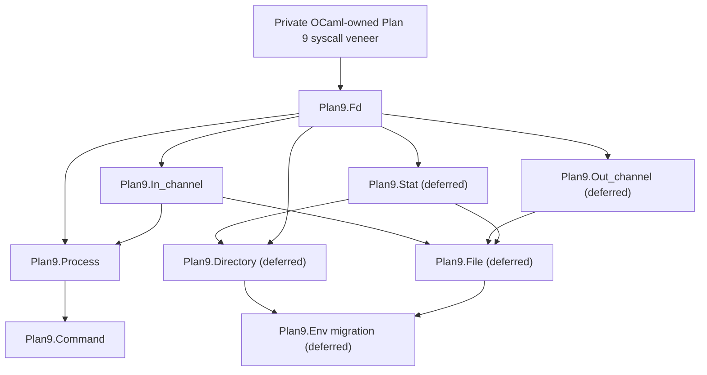

# OCaml Plan 9 native I/O foundation

Status: design draft for review; implementation has not started

Source handoff:
`C:\Users\dharm\src\caml9\docs\design\handoffs\ocaml-plan9-process-run-capture.md`

The Caml9 source remains unchanged. This document adopts the handoff's process
capture goal and records the subsequent decision to establish a reusable,
Plan 9-native I/O foundation before implementing capture.

## Repository identities

- Published Plan 9 baseline: `plan9-4.14.3-000` at
  `a98e773a80311653d7a78763bd017328b5c26b52`.
- `origin/plan9-4.14.3-000` still resolved to that published commit when this
  design branch was created.
- Local working base: `plan9-4.14.3-000` at
  `835bc29b0c276a83211a517b950a55f0fb9c2bfe`. Its only change from the
  published baseline is the reviewed local Plan 9 workflow skills.
- Design and implementation branch: `codex/plan9-native-io-foundation`,
  created at `835bc29b0c276a83211a517b950a55f0fb9c2bfe`.
- Preserved prototype branch:
  `codex/archive/plan9-process-capture-prototype` at
  `1eb780b1b8467d1b80b35102e40371b87dde5604`. It is intentionally
  unvalidated and retains the rejected ordinary-`in_channel`/APE descriptor
  integration only as design history.

The feature branch must not be merged and no replacement OCaml release may be
published until its implemented layers have been reviewed and independently
qualified on native Plan 9. Commits and pushes require explicit user approval.

## How to read this document

Each requirement is one of the following:

- **Decision**: agreed architecture that implementation must follow.
- **Phase 0 experiment**: a narrow build or ABI fact that must be proven before
  the public foundation is implemented.
- **Deferred decision**: intentionally settled when its owning layer is
  designed and reviewed.
- **Non-goal**: excluded from this work.
- **Acceptance criterion**: evidence required before a layer is accepted.

The first implementation milestone is only the private syscall veneer and its
proof. The broader module map is included so that this foundation does not
accidentally force later layers into an unsuitable dependency structure.

## Motivation and end-to-end target

The motivating application needs a direct command call whose successful use
is as small as:

```ocaml
let lines =
  Plan9.Command.run_capture_lines_exn
    ~program:"/bin/ndb/query"
    ~args:[| "-a"; "sys"; sysname; "ether" |]
    ()
```

The command must use a literal argument vector, capture stdout without a
temporary file, and return the output as lines. It must not use a shell, PATH
search, quoting, expansion, APE process dispatch, or NDB-specific logic.

The lower-level process operation must first capture the exact stdout bytes.
Line splitting belongs to `Plan9.Command` (using the native input semantics),
not to the process primitive. This preserves embedded NUL bytes, empty output,
newlines, and an unterminated final line at the reusable process layer.

## APE-independence boundary

**Decision.** The OCaml executable remains the single standard, APE-linked
`ocamlrun`. Portable `Stdlib`, `Sys`, and `Unix` behavior remains unchanged.
There will be no second runtime and no incompatible Plan 9-only OCaml runtime.

For the new native path, "APE-independent" means:

- no APE POSIX I/O, descriptor, process, environment, or wait facade;
- no APE `_fdinfo` registration or state;
- no APE-private syscall entry symbols such as `_PIPE`, `_PREAD`, `_READ`,
  `_WRITE`, `_CLOSE`, `_RFORK`, `_EXEC`, `_AWAIT`, or `_WAIT`;
- no APE wait parser, allocation, error translation, or process dispatch; and
- no conversion of a native descriptor into an ordinary OCaml `in_channel` or
  `out_channel`.

The raw syscall tier must call no C library function at all. The runtime
integration tier may use OCaml runtime allocation, rooting, and byte-copy
facilities; those are not the operating-system I/O path. The whole executable
may still contain and use APE for unrelated portable APIs.

This boundary is stronger than the current implementation:

| Existing module | Current native property | Remaining APE dependency |
| --- | --- | --- |
| `Plan9.Env` | Uses the live `/env` namespace instead of APE's cached environment | `Sys.readdir`, ordinary channels, and `Sys.remove` use the existing APE I/O path |
| `Plan9.Raw` | Avoids shell and APE process dispatch | Calls APE-private direct-entry symbols |
| `Plan9.Process` | Owns process lifecycle in OCaml and avoids POSIX spawning | Calls APE-private direct entries and the allocating `_WAIT` helper |

Those modules are migrated only when their dependency layer is ready. No
existing API is silently claimed to be fully APE-independent before then.

## Layered architecture

**Decision.** Public modules are small, have one-way dependencies, and are
implemented and reviewed from the bottom up.



The installed umbrella module `Plan9` only re-exports public modules and shared
types. Internal modules must never depend on the umbrella, preventing cycles
and making their actual dependencies visible in the build.

The intended ML source split is:

- `Plan9_types`: private shared error and identity types;
- `Plan9_primitive`: private bindings to validated runtime primitives;
- `Plan9_fd`: native descriptor ownership and byte I/O;
- `Plan9_in_channel`: buffered native input;
- `Plan9_process`: managed process lifecycle and capture; and
- `Plan9_command`: convenience command operations.

Only `plan9.cmi` is installed. Internal compilation interfaces remain
uninstalled, as `plan9_process.cmi` does today. `plan9.cma` remains ML-only;
the standard Plan 9 `ocamlrun` supplies the built-in primitives.

## Qualified source facts

The design fact check used the read-only 9front release checkout:

- location: `/home/dharmatech/src/9front-11554` in WSL;
- Git commit: `2191d72205863d2c53ea6ac36991cb4c13204c7c`;
- working tree: clean during the inspection; and
- initial architecture: amd64.

Relevant implementation sources are:

- `sys/src/libc/9syscall/mkfile:64-71`, for the amd64 stub recipe;
- `sys/src/libc/9syscall/sys.h:2-52`, for syscall numbers;
- `sys/src/libc/9sys/read.c` and `write.c`, which implement native logical
  reads and writes with `pread`/`pwrite` at offset `-1`;
- `sys/src/9/pc64/l.s:918-959` and `trap.c:413-434`, for the amd64 kernel
  entry convention;
- `sys/src/ape/lib/ap/syscall/genall:1-16`, for APE's separate private
  entries; and
- `sys/src/ape/lib/ap/plan9/9wait.c:65-92`, `9read.c:7-10`,
  `read.c:9-45`, and `close.c:7-34`, for the APE helpers and descriptor
  bookkeeping being avoided.

Matching interface documentation came from `sys/man/2/errstr`, `pipe`, `read`,
`wait`, `fork`, `exec`, `dup`, and `open` in the same checkout. The tree's
`lib/legal/NOTICE` places the relevant Plan 9 and 9front work under the MIT
license.

**Phase 0 experiment.** The selected source is the ABI reference for the
draft, not proof of the exact files used to build a future guest kernel and
libraries. Before acceptance, the authorized development guest must report
its release and architecture, and the exercised behavior must agree with this
reference. A mismatch stops the gate; it is not silently treated as release
11554.

## Private syscall veneer

### Two internal tiers

**Decision.** The veneer is split into two tiers with different safety rules.

1. The raw syscall entry tier accepts only native C values and caller-owned
   buffers. It allocates nothing, constructs no OCaml value, consults no APE
   state, and calls no APE or C library function. It is safe for the constrained
   post-`rfork`, pre-`exec` child path.
2. The runtime integration tier validates OCaml values, roots them, stages
   bytes outside the OCaml heap when a blocking section requires it, invokes
   the raw tier, captures native errors immediately, and never allocates in a
   blocking section. Any fallible OCaml allocation needed to publish ownership
   of newly created native resources occurs before their acquisition, or the
   resources are closed before an allocating path can be taken.

The raw functions use repository-prefixed symbols such as
`caml_plan9_sys_pipe` and `caml_plan9_sys_pread`. They must not define or call
the native libc names or APE's underscore-prefixed names.

### Initial amd64 ABI

**Decision.** The first implementation and qualification target is amd64
9front. Other Plan 9 architectures receive neither a copied amd64 veneer nor
an APE fallback. They require their own reviewed assembly entry file and
qualification.

The release-specific native syscall mapping is:

| Logical operation | Raw syscall | Number | Native signature used by the veneer |
| --- | --- | ---: | --- |
| capture error | `ERRSTR` | 41 | `int (char *, unsigned int)` |
| close | `CLOSE` | 4 | `int (int)` |
| duplicate | `DUP` | 5 | `int (int, int)` |
| execute | `EXEC` | 7 | `int (char *, char **)` |
| exit | `EXITS` | 8 | nonreturning `void (char *)` |
| open | `OPEN` | 14 | `int (char *, int)` |
| copy/create process | `RFORK` | 19 | `int (int)` |
| pipe | `PIPE` | 21 | `int (int *)` |
| create | `CREATE` | 22 | `int (char *, int, unsigned long)` |
| await child | `AWAIT` | 47 | `int (char *, int)` |
| logical read | `PREAD` | 50 | `long (int, void *, long, long long)` with offset `-1` |
| logical write | `PWRITE` | 51 | `long (int, void *, long, long long)` with offset `-1` |

The matching native `ERRMAX` is 128 bytes. The implementation records that
qualified bound under a repository-owned prefixed constant; it must not include
APE's private `sys9.h` to obtain declarations or constants.

Phase 0 implements only error capture, pipe, logical read, logical write, and
close. The remaining entries are added when an accepted layer needs them.

On amd64, the 9front libc recipe saves the incoming first-argument register in
the first stack argument slot, places the syscall number in `RARG`, executes
`SYSCALL`, and returns the kernel result. The repository-owned stubs will
follow that ABI under distinct symbols.

**Decision.** The small architecture file is checked into the repository. A
normal OCaml build must not generate it from `/sys/src`, because the build must
remain reproducible when system source is absent or differs. Each literal
syscall number carries its source path, release commit, and operation name in
comments. A maintainer check may compare the recorded manifest with a selected
source tree, but that check is not an ordinary consumer build dependency.

The implementation is derived from the documented ABI and minimal MIT-licensed
stub recipe. It must contain an attribution/provenance comment and no copied
unrelated 9front code.

### Error handling

**Decision.** A failing raw syscall returns the kernel value unchanged. The
runtime tier calls raw `ERRSTR` immediately, with an initially empty
128-byte, qualified-`ERRMAX` buffer, before leaving the blocking section or
performing any cleanup syscall that could replace the error. The resulting
NUL-terminated text is copied into the existing structured `Plan9.error`
representation.

The veneer does not use native `rerrstr`, because it is a libc helper rather
than a syscall. It does not translate through `errno`.

Interruption is not retried implicitly. The Plan 9 `pipe(2)` documentation
states that an interrupted pipe read or write may have transferred an unknown
number of bytes. Retrying could duplicate or lose data. A positive short read
or write is returned as such; higher layers decide whether to continue. A
negative result and its captured `errstr` remain one indivisible failure.

### OCaml heap and blocking sections

**Decision.** No raw syscall receives a pointer into a movable OCaml value
while the runtime is in a blocking section. Reads use a bounded native staging
buffer, then copy the successful byte count into a rooted OCaml `bytes` value
after leaving the blocking section. Writes copy from the validated OCaml range
into a native staging buffer before entering the blocking section.

For a resource-producing call such as `pipe`, rooted OCaml blocks sufficient
to return the owning success value are allocated and initialized before the
native call. Once the descriptors exist, no fallible OCaml allocation may
occur before their ownership is published or both descriptors are closed.

The exact per-call staging capacity is a **Phase 0 experiment**. It will be
bounded, independent of the total stream size, and no larger than both the
native signed `long` range and a practical runtime allocation. Higher layers
must already tolerate short reads and writes, so the chunk size is not an API
property.

### Child-safe subset

**Decision.** Child-side process code may call only raw functions explicitly
marked child-safe. It must use preallocated or stack storage, must not enter or
leave an OCaml blocking section, allocate, free, format with libc, invoke an
OCaml callback, or return to ML. Failure framing uses bounded caller-owned
buffers and raw write/exit operations.

Parent-side runtime wrappers and child-side raw functions share syscall entry
symbols but not allocation or error-construction code.

### Proposed source boundary

The initial file layout is expected to be:

- `runtime/plan9_syscall_amd64.s`: checked-in prefixed raw entries;
- `runtime/plan9_syscall.h`: private native-only declarations and child-safe
  contracts;
- `runtime/plan9_syscall.c`: validated OCaml runtime integration; and
- focused private tests under `otherlibs/plan9/tests`.

The private header must remain outside `runtime/caml`: the runtime install rule
copies `runtime/caml/*.h` into the installed OCaml include directory.

**Phase 0 experiment.** The Plan 9 `c89` driver compiles C with the native
architecture compiler but ignores `.s` inputs. The build proof must establish
the exact `6a` invocation, object suffix, archive membership, dependency rule,
and host-triple selection in the existing GNU Make build. Because the OCaml
native compiler is disabled, the rule must not assume that OCaml's `ARCH`
variable selects amd64. It must use a fact actually present in the configured
Plan 9 build, fail clearly for unsupported Plan 9 CPUs, and leave non-Plan-9
builds unchanged.

The primitive inventory generator must include every new `CAMLprim` exactly
once for Plan 9 and never for other targets.

## `Plan9.Fd` target contract

`Plan9.Fd` is the first public layer after the veneer. It is a safe native
descriptor abstraction, not a public raw integer API.

The provisional minimal interface is:

```ocaml
module Fd : sig
  type t

  val pipe : unit -> ((t * t), error) result
  val read : t -> bytes -> pos:int -> len:int -> (int, error) result
  val write : t -> bytes -> pos:int -> len:int -> (int, error) result
  val close : t -> (unit, error) result
end
```

**Decision.** `Fd.t` contains shared ownership state. Copying an OCaml value
aliases the same handle; it does not duplicate the kernel descriptor. Closing
through any alias makes every alias closed. Repeated `close` calls are
idempotent. If the raw close reports an unexpected failure, the handle is
still terminalized so an uncertain kernel descriptor cannot later be reused
through that handle.

The ownership cell can also become attached to a higher-level native object.
After attachment, retained `Fd.t` aliases cannot read, write, close, or attach
the descriptor again; those operations return a structured
`Invalid_argument` error without native work. The owning higher layer receives
private access to the same cell and is solely responsible for closing it. This
prevents direct reads from invalidating a channel's buffer.

The initial API has no `of_int`, `to_int`, standard-descriptor adoption,
arbitrary `dup`, finalizer, or escape hatch. This avoids desynchronizing APE's
state for descriptors that APE already owns. Native descriptors enter the
layer only through native constructors or private adoption from a native
runtime primitive.

Passing an `Fd.t` to `Stdlib`, `Sys`, `Unix`, or an ordinary OCaml channel is
unsupported. Conversely, `Plan9.Fd` cannot adopt a descriptor owned by those
APIs in the initial design.

Plan 9 pipes are bidirectional peer endpoints. `pipe` must not falsely encode
Unix-only read-end/write-end capabilities, although a caller such as process
capture may assign those roles and close unused directions.

Argument range errors and use-after-close return a structured
`Invalid_argument` error without a syscall. Native failures preserve the
operation and exact captured error text.

The exact interface is reviewed again before the `Fd` implementation starts.

## `Plan9.In_channel` target contract

`Plan9.In_channel.t` is a distinct abstract native type, not an alias of
`Stdlib.in_channel`. Its concepts intentionally resemble OCaml's `In_channel`
module while its backend and semantics are native Plan 9.

The provisional initial interface is:

```ocaml
module In_channel : sig
  type t

  val of_fd : Fd.t -> t
  val close : t -> (unit, error) result
  val input : t -> bytes -> pos:int -> len:int -> (int, error) result
  val input_line : t -> (string option, error) result
  val input_all : t -> (string, error) result
  val input_lines : t -> (string list, error) result
end
```

`of_fd` transfers operational ownership to the channel. Once it returns,
retained aliases of the originating `Fd.t` are attached and reject further
descriptor operations; closing the channel closes and terminalizes the shared
cell. If channel allocation fails before the transfer completes, the original
descriptor remains open. The channel adds ML-owned buffering and never
registers the descriptor with APE.

Input is binary. A line ends only at byte `0x0a`; the terminator is omitted.
Carriage return and embedded NUL are ordinary bytes. Empty input yields no
lines, a single newline yields one empty line, a trailing newline does not add
an extra line, and an unterminated final line is returned. `input_all` and
`input_lines` are explicitly bounded by OCaml's representable string/list
memory and are intended for bounded streams.

Seeking, positions, length, text-mode translation, standard-input adoption,
and file opening are deferred to the file/stat layers. The exact interface is
reviewed before this layer begins.

## Process migration and capture target

After `Fd` and `In_channel` are qualified, the existing process runtime code
is migrated from APE-private entries to the native veneer without changing
its public lifecycle contract. In particular:

- the never-reused managed identity and pending-child publication remain;
- every post-`rfork` nonterminal result retains the exact process handle;
- an outer `Error` still means no child created by the call remains;
- one synchronous ML coordinator still owns native wait routing; and
- foreign completion retention, interruption, and queue-loss behavior remain.

Native `await` replaces APE's `_WAIT`. The runtime returns the bounded textual
record without APE allocation; repository-owned code parses it and preserves
the complete native message and unsigned millisecond fields.

The capture operation then creates a second native pipe in addition to the
exec-failure handshake. The nonreturning child attaches one endpoint to file
descriptor 1 using the raw child-safe subset. The parent privately adopts the
other endpoint as `Fd.t`, wraps it in `Plan9.In_channel`, drains it to EOF while
the child runs, and only then completes the ordinary managed wait. Waiting
before draining is forbidden because output larger than the pipe buffer would
deadlock.

The byte-oriented process API remains the adopted handoff shape, subject to a
fresh review when its layer begins:

```ocaml
type captured_run = {
  outcome : run;
  stdout : string;
}

type capture_failure =
  | Capture_launch_incomplete of launch_incomplete
  | Capture_read_error of error

type run_capture =
  | Capture_complete of captured_run
  | Capture_failed of {
      process : t;
      stdout_prefix : string;
      reason : capture_failure;
    }

val run_capture :
  program:string ->
  args:string array ->
  unit ->
  (run_capture, error) result
```

`Capture_complete` means stdout reached EOF and is exact; it does not assert a
successful child status. `Capture_failed` preserves the exact readable prefix
and managed handle. Standard error remains inherited. Existing `spawn`, `run`,
`Inherit`, and `Truncate` behavior remains unchanged.

## `Plan9.Command` target

`Plan9.Command` is the convenience layer. Its target successful API is:

```ocaml
val run_capture_lines :
  program:string ->
  args:string array ->
  unit ->
  (string list, failure) result

val run_capture_lines_exn :
  program:string ->
  args:string array ->
  unit ->
  string list
```

`run_capture_lines_exn` returns the line list directly with no success-side
pattern matching. It raises a `Plan9.Command` exception carrying a structured
`failure` when setup, capture, lifecycle resolution, or the command's native
status is unsuccessful. Any failure that still owns a child must carry the
exact managed handle, just as the lower process layer does.

The exact failure type and exception name are a **deferred decision** for the
Command-layer review. They cannot be finalized safely before the capture
ownership type is accepted. The convenience function must never erase an
unresolved handle merely to obtain a smaller exception type.

## Implementation sequence and review gates

Each layer follows design review, implementation, focused tests, native
qualification, demo review, and a coherent commit before the next layer starts.

### Phase 0: syscall veneer proof

Implement only raw error capture, pipe, logical read, logical write, close,
the minimum validated internal primitives needed to exercise them, and build
wiring. Add no public `Plan9` API.

Acceptance requires:

- the standard amd64 Plan 9 `ocamlrun` builds in the existing APE/GNU Make
  lane and contains each private primitive exactly once;
- a private ML test performs a binary pipe round trip, observes EOF after the
  writer closes, handles short I/O correctly, and preserves embedded NUL;
- a deliberate invalid-descriptor operation returns the immediate native
  error string without `errno` translation;
- repeated runs leave no descriptor behind;
- object-level symbol inspection proves that the new veneer objects do not
  reference APE I/O/process wrappers or private direct-entry symbols;
- source inspection proves the raw assembly objects have no undefined library
  calls;
- existing Plan 9 tests still pass; and
- `plan9.cma` remains ML-only and ordinary installed use still needs no
  `-custom`, alternate runtime, compiler, linker, or wrapper compiler.

No installed prefix is changed until the user approves an isolated test prefix.
No VM is started until the user confirms the instance, loopback address, and
action.

### Phase 1: `Plan9.Fd`

Review and implement the abstract ownership cell, native pipe construction,
byte reads/writes, deterministic close, forged primitive validation,
use-after-close behavior, alias close behavior, short I/O, interruption
policy, and descriptor-leak tests.

### Phase 2: `Plan9.In_channel`

Review and implement buffering, exact bytes, `input`, `input_line`,
`input_all`, `input_lines`, EOF cases, arbitrarily split delimiters, long
lines, embedded NUL, unterminated final lines, and cleanup.

### Phase 3: process backend migration

Add the remaining raw syscall entries required by current process operations,
replace every APE-private process/I/O entry, replace `_WAIT` with raw `await`
and private parsing, and rerun the complete existing ownership and native
integration suites before adding capture.

### Phase 4: capture and command convenience

Implement exact stdout capture through `Fd` and `In_channel`, then add
`Command.run_capture_lines` and `run_capture_lines_exn`. Validate empty,
multiline, embedded-NUL, unterminated, larger-than-pipe-buffer, literal shell
metacharacter, nonempty-status, exec-failure, interrupted-read,
interrupted-wait, descriptor-hole, repeated-call, and ownership-cleanup cases.

Timing-sensitive note interruption remains a separate explicitly authorized
qualification gate. No production fault switch or independent waiter is added.

### Later native I/O layers

`Out_channel`, `Stat`, `Directory`, `File`, and `Env` migration are designed
and implemented individually after the capture path. Directory reads require
specialized Plan 9 stat-record decoding rather than treatment as a generic
byte channel.

## Explicit non-goals

This design does not authorize:

- replacement or behavioral change of portable `Stdlib`, `Sys`, or `Unix`;
- a second or wholly APE-free `ocamlrun`;
- removal of the existing APE/GNU Make build lane;
- a silent APE fallback for native modules;
- native-code compiler, shared-library, systhreads, or custom-runtime work;
- public raw descriptor integers, arbitrary `rfork` masks, or a raw waiter;
- shell execution, PATH search, pipelines, quoting, or expansion;
- stdin or stderr capture, asynchronous streaming, or temporary-file capture;
- unbounded output buffering;
- NDB- or Caml9-specific behavior in OCaml; or
- implementation of every future native I/O module in one change.

## Departures from the original handoff

The original handoff deliberately excluded a public descriptor API and asked
for one narrow `Plan9.Process.run_capture` feature branch. Subsequent review
found that converting its native pipe to an ordinary `in_channel` required APE
descriptor registration and made the new path depend on APE I/O. The user then
selected a bottom-up native design with safe `Plan9.Fd` and
`Plan9.In_channel` layers.

Accordingly:

- the feature branch is `codex/plan9-native-io-foundation`, not the handoff's
  suggested capture-only branch;
- a safe abstract descriptor API is now intentional, while raw integers remain
  private;
- capture is a later vertical slice over the accepted foundation; and
- the earlier capture prototype is preserved on an archive branch but is not
  an implementation base.

These are explicit design changes, not accidental scope growth. Work within
each implementation phase remains narrow, separately reviewed, and separately
validated.

## Required reports

Every accepted layer reports:

- the exact source branch and commit tested;
- the selected 9front source/release and guest identity;
- files changed and final public API, if any;
- exact native commands and results;
- symbol and packaging evidence;
- deviations from this document and their rationale;
- the approved test install prefix and confirmation that the known compiler
  prefix was unchanged; and
- final worktree, index, local branch, and remote-tracking status.

The final capture handoff additionally reports the adopted document path,
exact base and feature identities, complete capture and command APIs, and the
native results needed for Caml9 review. It must not merge the branch or publish
a replacement release.
